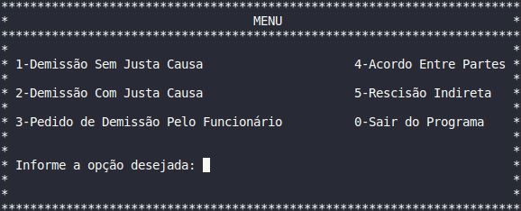

# Verbas Rescisórias

Software Verbas Rescisórias.

Como todos sabemos, o processo de rescisão de contrato de trabalho pode ser complicado e estressante para ambas as partes envolvidas. Para o empregador, é necessário realizar cálculos complexos para determinar as verbas rescisórias que devem ser pagas ao empregado. Já para o empregado, é crucial ter certeza de que está recebendo todos os valores que lhe são devidos de forma justa e correta.

E é exatamente nesse ponto que o software Verbas Rescisórias se destaca. Ele foi criado para simplificar todo o processo de cálculo das verbas rescisórias, tornando-o mais rápido, eficiente e preciso. Com esse software, os empregadores podem ter a certeza de que estão calculando corretamente as verbas rescisórias e pagando aos empregados tudo o que lhes é devido, sem correr o risco de erros que podem gerar problemas jurídicos e financeiros.

Além disso, o software Verbas Rescisórias também oferece diversos benefícios para os empregados. Com ele, é possível ter acesso a informações precisas sobre os valores que serão pagos na rescisão do contrato, incluindo férias, 13º salário, aviso prévio, entre outros. Isso torna todo o processo mais transparente e justo para ambas as partes envolvidas.

Portanto, eu gostaria de encorajar a todos aqui presentes a considerarem a implementação do software Verbas Rescisórias em suas empresas. Com ele, podemos tornar todo o processo de rescisão de contrato mais tranquilo e justo para todos os envolvidos. Afinal, é nosso dever como empregadores e empregados garantir que todas as verbas rescisórias sejam calculadas e pagas de forma justa e correta.

Obrigado pela atenção de todos.
